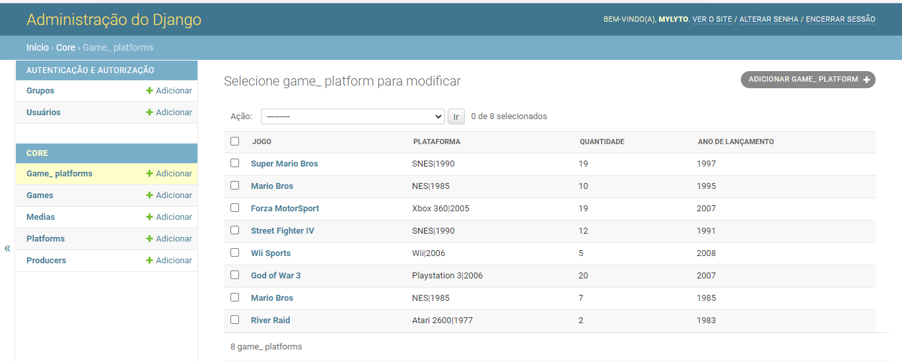
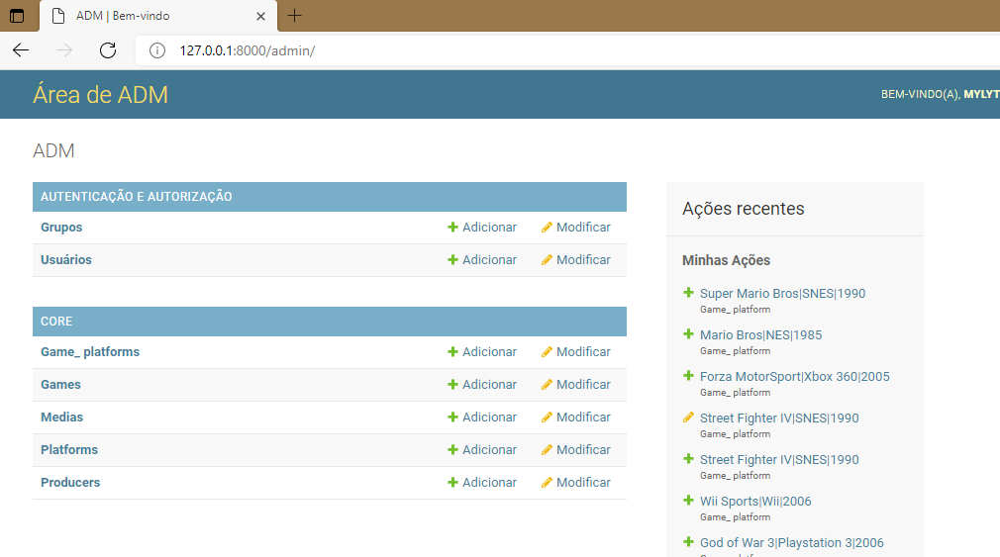

# 1. Página de Administração

- [Tutorial Django Parte 4: Django admin site](https://developer.mozilla.org/pt-BR/docs/Learn/Server-side/Django/Admin_site)
- [Django Dashboards - Open-Source and Free ](https://dev.to/sm0ke/django-admin-dashboards-open-source-and-free-1o80)
- [Django Admin: melhora na interface de administração](https://www.devmedia.com.br/django-admin-melhora-na-interface-de-administracao/30133)
- [Aula 24 – Formulário de administração do Django](https://www.codigofluente.com.br/formulario-admin-do-django-continuacao/)
- [The Django admin site](https://docs.djangoproject.com/en/3.2/ref/contrib/admin/)

O Django oferece uma interface de administração quer permite listar um conjunto de dados de uma aplicação e realizar o CRUD sobe os objetos cadastrados. 

 O projeto Django o recomenda apenas para gerenciamento interno de dados (ou seja, apenas para uso por administradores ou pessoas internas à sua organização), pois a abordagem centrada no modelo não é necessariamente a melhor interface possível para todos os usuários e expõe muitos detalhes desnecessários sobre os modelos.


- [1. Página de Administração](#1-página-de-administração)
  - [1.1. Criando Modelo](#11-criando-modelo)
  - [1.2. Criando Super Usuário](#12-criando-super-usuário)
  - [1.3. Registrando Modelo](#13-registrando-modelo)
  - [1.4. Cadastrar Dados](#14-cadastrar-dados)
  - [1.5. Nome De listagem do Objeto](#15-nome-de-listagem-do-objeto)
  - [1.6. Atributos](#16-atributos)
    - [1.6.1. Listar Informações dos dados](#161-listar-informações-dos-dados)
    - [1.6.2. Formulário Personalizado](#162-formulário-personalizado)
    - [1.6.3. Definir Campos de Leitura](#163-definir-campos-de-leitura)
    - [1.6.4. Definindo Filtros](#164-definindo-filtros)
    - [1.6.5. Navegação por Datas](#165-navegação-por-datas)
    - [1.6.6. Valor Parão para Valores Nulos](#166-valor-parão-para-valores-nulos)
    - [1.6.7. Removendo Campos - exclude](#167-removendo-campos---exclude)
    - [1.6.8. Agrupar Campos](#168-agrupar-campos)
    - [1.6.9. Personalizar Campos com Fieldset](#169-personalizar-campos-com-fieldset)
    - [1.6.10. Personalizar ManyToManyField](#1610-personalizar-manytomanyfield)
    - [1.6.11. Alterar o Tipo do Campo](#1611-alterar-o-tipo-do-campo)
    - [1.6.12. Link de Alteração](#1612-link-de-alteração)
    - [1.6.13. Facilitando a edição de dados](#1613-facilitando-a-edição-de-dados)
    - [1.6.14. Limitar o Número de Objetos](#1614-limitar-o-número-de-objetos)
    - [1.6.15. Limitar o número de Objetos por Página](#1615-limitar-o-número-de-objetos-por-página)
    - [1.6.16. Ordenar Objetos](#1616-ordenar-objetos)
    - [1.6.17. Preenchendo SlugField](#1617-preenchendo-slugfield)
    - [1.6.18. Salvar Objeto como Novo](#1618-salvar-objeto-como-novo)
    - [1.6.19. Caixa de Pesquisa](#1619-caixa-de-pesquisa)
    - [1.6.20. Desativar a Ordenação Por Coluna](#1620-desativar-a-ordenação-por-coluna)
    - [1.6.21. Edição inline de registros associados](#1621-edição-inline-de-registros-associados)
  - [1.7. Personalizar a Área de Administração](#17-personalizar-a-área-de-administração)
  - [1.8. Adicionar Temas](#18-adicionar-temas)
  - [1.9. Editar arquivos HTML](#19-editar-arquivos-html)


## 1.1. Criando Modelo

- Os modelos dos dados precisam estar criados, para o exemplo usaremos o modelo de um produto. 

```python
ffrom re import T
from django.db import models
from datetime import datetime
from django.core.validators import MaxValueValidator, MinValueValidator


class Producer(models.Model):
    name = models.CharField('Nome', max_length=45)
    year_fundation = models.IntegerField('Ano da Fundação', validators=[
                                         MinValueValidator(1000), MaxValueValidator(9999)])

    def __str__(self):
        return f'{self.name}'


class Media(models.Model):
    name = models.CharField('Mídia', max_length=45)
    speed = models.IntegerField(
        name="Velocidade de Leitura", validators=[MinValueValidator(0)])

    def __str__(self):
        return f'{self.name}'


class Platform(models.Model):
    name = models.CharField('Plataforma', max_length=45)
    year_release = models.IntegerField('Ano de Lançamento',  validators=[
                                       MinValueValidator(1000), MaxValueValidator(9999)])
    memory = models.IntegerField("Memória", validators=[
                                 MinValueValidator(0), MaxValueValidator(9999)])
    producer = models.ForeignKey(
        Producer, verbose_name="Produtora", on_delete=models.CASCADE)

    media = models.ManyToManyField(Media, verbose_name="Mídia")

    def __str__(self):
        return f'{self.name}|{self.year_release}'


class Game(models.Model):
    name = models.CharField('Jogo', max_length=100)
    description = models.TextField("Descrição", max_length=500)
    platform = models.ManyToManyField(
        Platform, verbose_name=("Plataforma"), through='Game_Platform')

    def __str__(self):
        return f'{self.name}'


class Game_Platform(models.Model):
    game = models.ForeignKey(Game, verbose_name=(
        "Jogo"), on_delete=models.CASCADE)
    platform = models.ForeignKey(Platform, verbose_name=(
        "Plataforma"), on_delete=models.CASCADE)
    quantity = models.IntegerField('Quantidade', validators=[
                                   MinValueValidator(0), MaxValueValidator(9999)])
    year_release = models.IntegerField('Ano de Lançamento',  validators=[
                                       MinValueValidator(1000), MaxValueValidator(9999)])

    def __str__(self):
        return f'{self.game}|{self.platform}'
```

 ## 1.2. Criando Super Usuário

 - Antes é preciso construir o versionamento e construir o banco de dados com os comandos abaixo.

```shell
python manage.py makemigrations
python manage.py migrate
```

- Após a execução dos comandos, podemos criar um super usuário e seguir os passos para a criação.

``` shell
python3 manage.py createsuperuser
```

- Para acessar a área de administração, use o link 
  - `http://127.0.0.1:8000/admin/`

- Na interface já podemos ver que podemos criar grupos e outros usuários. 

  

## 1.3. Registrando Modelo

A forma mais simples, principalmente para testes, de cadastrar um objeto na área de administração é registrar o objeto com a sintaxe `admin.site.register(Modelo)`. 

```python
from django.contrib import admin
from .models import *

admin.site.register(Producer)
admin.site.register(Platform)
admin.site.register(Game)
admin.site.register(Media)
admin.site.register(Game_Platform)
```

E então o produto irá aparecer dentro da interface. 

 

## 1.4. Cadastrar Dados

- Clicando em adicionar, ou clicando em produtos e posteriormente em adicionar produto, poderemos fazer um cadastro de múltiplos objetos. 

 

## 1.5. Nome De listagem do Objeto

- Após o cadastro dos objetos, poderemos ver uma lista com os objetos cadastrados, entretanto irá, por padrão, exibir o nome do objeto. 
 
- Para definir o nome do objeto, em modelos, podemos usar a função `__str__()` para retornar o texto que desejamos. 

``` python
class Game_Platform(models.Model):
    game = models.ForeignKey(Game, verbose_name=(
        "Jogo"), on_delete=models.CASCADE)
    platform = models.ForeignKey(Platform, verbose_name=(
        "Plataforma"), on_delete=models.CASCADE)
    quantity = models.IntegerField('Quantidade', validators=[
                                   MinValueValidator(0), MaxValueValidator(9999)])
    year_release = models.IntegerField('Ano de Lançamento',  validators=[
                                       MinValueValidator(1000), MaxValueValidator(9999)])

    def __str__(self):
        return f'{self.game}|{self.platform}'
```


## 1.6. Atributos

- O `ModelAmin` possui diversos atributos que nos permitem personalizar o CRUD dos objetos na área administrativa. 

### 1.6.1. Listar Informações dos dados

- Caso queria que mais colunas apareçam, com outros dados do objeto, devemos criar um model admin e associá-lo ao modelo com o register após a definição da classe. 
  - `admin.site.register(Produto, ProdutoAdmin)`
- Outra forma é usar `decorators`, acima da classe de administração. 
  - `@admin.register(Produto)`
- O argumento `list_display` irá receber uma lista com o nome dos campos que devem aparecer na área de administração.

``` python
@admin.register(Game_Platform)
class Game_Platform(admin.ModelAdmin):
  list_display = ['game', 'platform', 'quantity', 'year_release']
```




### 1.6.2. Formulário Personalizado 

- Caso você queria usar um formulário personalizado para a administração, basta seguir os passos
  1. Criar um formulário que receba um modelo 
  2. Personalizar os campos, como alterar os widgets
  3. Sobrescreva o campo `form` da classe ModelAdmin com o novo formulário. 

``` python
from django.contrib import admin
from .models import Produto
from .forms import FormProduto

@admin.register(Produto)
class ProdutoAdmin(admin.ModelAdmin):
  list_display = ['titulo', 'preco', ]
  form = FormProduto
```

### 1.6.3. Definir Campos de Leitura

- A opção `readonly_fields`, recebe uma lista com os nomes dos campos que devem ser de apenas leitura na área de administração. 

``` python
@admin.register(Game_Platform)
class ProdutoAdmin(admin.ModelAdmin):
  list_display = ['game', 'platform', 'quantity', 'year_release',]
 readonly_fields = ('year_release', )
```

 

### 1.6.4. Definindo Filtros

- Usando a opção `list_filter` podemos definir quais campos do objeto terão um filtro de pesquisa. O filtro se ajusta automaticamente ao tipo dos dados. 
- Filtros funciona melhor para **dados categóricos**, como tipo de produtos, marcas, etc.
  
``` python
@admin.register(Game_Platform)
class ProdutoAdmin(admin.ModelAdmin):
  list_display = ['game', 'platform', 'quantity', 'year_release',]
  readonly_fields = ('year_release', )
  list_filter = ['game', 'platform']
```

 

- Podemos também alterar o HTML da página do filtro, caso queria saber como acesse (FilterWithCustomTemplate)[https://docs.djangoproject.com/en/3.2/ref/contrib/admin/#django.contrib.admin.ModelAdmin.list_filter]

### 1.6.5. Navegação por Datas 

- Defina `date_hierarchy` como o nome de um `DateField` ou `DateTimeField` em seu modelo, e a página da lista de alterações incluirá uma navegação detalhada baseada em data por esse campo. 
  - `date_hierarchy = 'pub_date'`
- Você também pode especificar um campo em um modelo relacionado usando a pesquisa `__`
  - `date_hierarchy = 'author__pub_date'`

### 1.6.6. Valor Parão para Valores Nulos 

Este atributo substitui o valor de exibição padrão para os campos do registro que estão vazios (Nenhum, string vazia, etc.). O valor padrão é `-` (um traço).

``` python
from django.contrib import admin

class AuthorAdmin(admin.ModelAdmin):
    empty_value_display = '-empty-'
```

### 1.6.7. Removendo Campos - exclude

Este atributo, se fornecido, deve ser uma lista de nomes de campos a serem excluídos do formulário. 

```Python
@admin.register(Game_Platform)
class ProdutoAdmin(admin.ModelAdmin):
  list_display = ['game', 'platform', 'quantity', 'year_release',]
  readonly_fields = ('year_release', )
  list_filter = ['game', 'platform']
  exclude = ( 'platform',)
```


### 1.6.8. Agrupar Campos

Use a opção de `fields` para fazer alterações de layout simples nos formulários nas páginas `adicionar` e `alterar`, como mostrar apenas um subconjunto de campos disponíveis, modificar sua ordem ou agrupá-los em linhas.
- Para agrupar os campos em uma mesma linha, deve-se, envolvê-los entre parênteses.  

```Python
@admin.register(Game_Platform)
class ProdutoAdmin(admin.ModelAdmin):
  list_display = ['game', 'platform', 'quantity', 'year_release',]
  fields = (('game', 'platform'), 'quantity', 'year_release', )
```


### 1.6.9. Personalizar Campos com Fieldset 

Defina os conjuntos de campos para controlar o layout das páginas de 'adição' e 'alteração' do administrador. `Fieldsets` é uma lista de duas tuplas, em que cada duas tuplas representa um `<fieldset>` na página do formulário de administração. (Um `<fieldset>` é uma 'seção' do formulário.)
- As duas tuplas estão no formato `(name, field_options)`, onde name é uma string que representa o título do fieldset e field_options é um dicionário de informações sobre o fieldset, incluindo uma lista de campos a serem exibidos nele.
- O dicionário `field_options` pode ter as seguintes chaves:
  - `field` -  Uma tupla de nomes de campo a serem exibidos neste conjunto de campos. Essa chave é obrigatória.
  - `class` -   Uma lista ou tupla contendo classes CSS extras para aplicar ao fieldset.
  - `Description` -  Uma string de texto extra opcional a ser exibida na parte superior de cada fieldset, sob o título do fieldset. Esta string não é renderizada para TabularInline devido ao seu layout.

```Python
@admin.register(Game_Platform)
class ProdutoAdmin(admin.ModelAdmin):
  list_display = ['game', 'platform', 'quantity', 'year_release', ]
  fieldsets = (
    ('Produto', {
        'fields': (('game', 'platform'),)
    }),
    ('Informações', {
        'fields': ('quantity', 'year_release',)
    }),
  )
```


### 1.6.10. Personalizar ManyToManyField

Por padrão, um `ManyToManyField` é exibido no site de administração com um `<selecionar múltiplo>`. No entanto, as caixas de seleção múltipla podem ser difíceis de usar ao selecionar muitos itens. Adicionar um `ManyToManyField` a esta lista, em vez disso, usará uma interface de 'filtro' JavaScript discreta e bacana que permite pesquisar nas opções. As opções não selecionadas e selecionadas aparecem em duas caixas lado a lado. 


```Python
class EmployeeAdmin(admin.ModelAdmin):
   filter_horizontal = ('campo',)
```


- Podemos também especificar filter_vertical, que é o mesmo que filter_horizontal, mas usa uma exibição vertical da interface do filtro com a caixa de opções não selecionadas aparecendo acima da caixa de opções selecionadas. 

```Python
class EmployeeAdmin(admin.ModelAdmin):
   filter_vertical = ('campo',)
```


### 1.6.11. Alterar o Tipo do Campo

O atributo `formfield_overrides` é um dicionário que mapeia uma classe de campo para um dicionário de argumentos para passar para o campo no momento da construção. O uso mais comum de `formfield_overrides` é adicionar um widget personalizado para um determinado tipo de campo. 


- [django-richtextfield](https://pypi.org/project/django-richtextfield/)

```Python
from djrichtextfield.widgets import RichTextWidget

@admin.register(Game)
class GameAdmin(admin.ModelAdmin):
    list_display = ['name', 'description']
    formfield_overrides = {
        models.TextField: {'widget': RichTextWidget()},
    }
```


### 1.6.12. Link de Alteração

Use `list_display_links` para controlar se e quais campos em `list_display` devem ser vinculados à página de 'mudança' de um objeto. Por padrão, a página da lista de alterações vinculará a primeira coluna - o primeiro campo especificado em list_display - à página de alterações de cada item. Mas `list_display_links` permite que você altere isso. 

```Python
@admin.register(Game_Platform)
class ProdutoAdmin(admin.ModelAdmin):
    list_display = ['game', 'platform', 'quantity', 'year_release', ]
    list_display_links = ['game', 'platform']
```


### 1.6.13. Facilitando a edição de dados

Defina `list_editable` como uma lista de nomes de campo no modelo que permitirá a edição na página da lista de alterações. Ou seja, os campos listados em `list_editable` serão exibidos como widget de formulário na página da lista de alterações, permitindo que os usuários editem e salvem várias linhas de uma vez. 

```Python
@admin.register(Game_Platform)
class ProdutoAdmin(admin.ModelAdmin):
    list_display = ['game', 'platform', 'quantity', 'year_release', ]
    list_editable  = ['quantity', 'year_release', 'platform']
```


### 1.6.14. Limitar o Número de Objetos

Defina `list_max_show_all` para controlar quantos itens podem aparecer em uma página de lista de alterações de administrador. O administrador exibirá um link “Mostrar todos” na lista de alterações apenas se a contagem total de resultados for menor ou igual a esta configuração. Por padrão, isso é definido como 200.

### 1.6.15. Limitar o número de Objetos por Página

Defina `list_per_page` para controlar quantos itens aparecem em cada página paginada da lista de alterações do administrador. Por padrão, isso é definido como 100. 

```Python
@admin.register(Game_Platform)
class ProdutoAdmin(admin.ModelAdmin):
    list_display = ['game', 'platform', 'quantity', 'year_release', ]
    list_editable  = ['quantity', 'year_release', 'platform']
    list_per_page = 2
```


### 1.6.16. Ordenar Objetos

Defina a ordenação para especificar como as listas de objetos devem ser ordenadas nas visualizações de administração do Django. Deve ser uma lista ou tupla no mesmo formato que o parâmetro de ordenação de um modelo. 

```Python
@admin.register(Game_Platform)
class ProdutoAdmin(admin.ModelAdmin):
    list_display = ['game', 'platform', 'quantity', 'year_release', ]
    ordering = ['-quantity']
```


### 1.6.17. Preenchendo SlugField 

Defina `prepopulated_fields` para um dicionário de mapeamento de nomes de campos para os campos que devem ser pré-preenchidos .

Quando definidos, os campos fornecidos usarão um pouco de JavaScript para preencher a partir dos campos atribuídos. O principal uso dessa funcionalidade é gerar automaticamente o valor para os campos do SlugField de um ou mais outros campos. O valor gerado é produzido concatenando os valores dos campos de origem e, em seguida, transformando esse resultado em um slug válido (por exemplo, substituindo travessões por espaços e letras ASCII minúsculas).

Os campos pré-preenchidos não são modificados pelo JavaScript depois que um valor é salvo. Normalmente não é desejado que os slugs mudem (o que faria com que o URL de um objeto mudasse se o slug fosse usado nele).

```Python
class ArticleAdmin(admin.ModelAdmin):
    prepopulated_fields = {"slug": ("title",)}
```

### 1.6.18. Salvar Objeto como Novo

Defina `save_as` para habilitar um recurso “salvar como novo” nos formulários de alteração de administrador.

Normalmente, os objetos têm três opções de salvamento: “Salvar”, “Salvar e continuar editando” e “Salvar e adicionar outro”. Se save_as for True, “Salvar e adicionar outro” será substituído por um botão “Salvar como novo” que cria um novo objeto (com um novo ID) ao invés de atualizar o objeto existente.

Por padrão, `save_as` é definido como `False`

### 1.6.19. Caixa de Pesquisa

Defina `search_fields` para habilitar uma caixa de pesquisa na página da lista de alterações do administrador. Isso deve ser definido como uma lista de nomes de campos que serão pesquisados sempre que alguém enviar uma consulta de pesquisa nessa caixa de texto. Podemos relacionar campos com `__`

```Python
@admin.register(Game_Platform)
class ProdutoAdmin(admin.ModelAdmin):
    list_display = ['game', 'platform', 'quantity', 'year_release', ]
    search_fields = ['game__name', 'platform__name', 'year_release', ]
```


### 1.6.20. Desativar a Ordenação Por Coluna

Se você deseja desativar a classificação para algumas colunas, defina `sortable_by` para uma coleção (por exemplo, lista, tupla ou conjunto) do subconjunto de list_display que você deseja que seja classificável. Uma coleção vazia desativa a classificação de todas as colunas.

### 1.6.21. Edição inline de registros associados

Às vezes, pode fazer sentido adicionar registros associados ao mesmo tempo. Por exemplo, pode fazer sentido ter as informações do livro e as informações sobre as cópias específicas que você tem na mesma página de detalhes.

- **Mostra todos os dados que estão ligados por uma chave estrangeira**

- TabularInline (horizonal layout)
- StackedInline (layout vertical, assim como o layout do modelo padrão)

```Python
class PlatformInstanceInline(admin.TabularInline):
    model = Platform

@admin.register(Producer)
class ProducerAdmin(admin.ModelAdmin):
    list_display = ['name', 'year_fundation']
    inlines = [PlatformInstanceInline]
```


- Assim como o ModelAdmin, os Inline também possuem as opções de personalização, como `form`, `fields`, `fieldsets`, `exclude`, etc. Entretanto, exitem algumas personalizações extras, como: 
  - `model` -  O modelo que o inline está usando. Isso é obrigatório. 
  - `fk_name` -  O nome da chave estrangeira no modelo. Na maioria dos casos, isso será tratado automaticamente, mas fk_name deve ser especificado explicitamente se houver mais de uma chave estrangeira para o mesmo modelo pai. 
  - `formset` - O padrão é BaseInlineFormSet. Usar seu próprio formset pode lhe dar muitas possibilidades de customização. Inlines são construídos em torno de conjuntos de formulários de modelo. 
  - `max_num` - Isso controla o número máximo de formulários a serem exibidos na linha. Isso não se correlaciona diretamente com o número de objetos, mas pode se o valor for pequeno o suficiente. 
  - `min_num` - Isso controla o número mínimo de formulários a serem exibidos na linha
  - `raw_id_fields` -  Por padrão, o administrador do Django usa uma interface de caixa de seleção (`<select>`) para campos que são ForeignKey. Às vezes, você não quer incorrer na sobrecarga de ter que selecionar todas as instâncias relacionadas para exibir no menu suspenso. `raw_id_fields` é uma lista de campos que você gostaria de transformar em um widget de entrada para ForeignKey ou ManyToManyField.
  - `template` -  O modelo usado para renderizar o embutido na página. 
  - `verbose_name` -  Uma substituição para o verbose_name encontrado na classe Meta interna do modelo.
  - `verbose_name_plural` -  Uma substituição para verbose_name_plural encontrado na classe Meta interna do modelo.
  - `can_delete` - Especifica se os objetos embutidos podem ou não ser excluídos no embutido. O padrão é True.
  - `show_change_link` - Especifica se os objetos embutidos que podem ser alterados no admin têm ou não um link para o formulário de alteração. O padrão é False. 
- [InlineModelAdmin options](https://docs.djangoproject.com/en/3.2/ref/contrib/admin/#inlinemodeladmin-options)

```Python
class PlatformInstanceInline(admin.TabularInline):
    model = Platform
    raw_id_fields = ('media',)
    fields = (('name', 'year_release' ))


@admin.register(Producer)
class ProducerAdmin(admin.ModelAdmin):
    list_display = ['name', 'year_fundation']
    inlines = [PlatformInstanceInline]
```


## 1.7. Personalizar a Área de Administração

Existem algumas personalizações básicas que podemos realizar no site, como alterar o títulos da área de administração. 


- `AdminSite.site_header` -  O texto a ser colocado no topo de cada página de administração, como um `<h1>` (uma string). Por padrão, esta é a 'administração do Django'.
- `AdminSite.site_title` -  O texto a ser colocado no final de cada `<title>` da página de administração (uma string). Por padrão, é 'administrador do site Django'.
- `AdminSite.site_url` -  O URL para o link 'Exibir site' na parte superior de cada página de administração. Por padrão, site_url é `/.` Defina como Nenhum para remover o link.
- `AdminSite.index_title` -  O texto a ser colocado no topo da página de índice do administrador (uma string). Por padrão, é 'Administração do site'.
- `AdminSite.index_template` -  Caminho para um modelo personalizado que será usado pela exibição de índice principal do site de administração.
- `AdminSite.app_index_template` - Caminho para um modelo personalizado que será usado pela exibição de índice do aplicativo do site de administração.
- `AdminSite.empty_value_display` -  A string a ser usada para exibir valores vazios na lista de alterações do site de administração. O padrão é um traço. O valor também pode ser substituído por ModelAdmin e em um campo personalizado em um ModelAdmin, definindo um atributo empty_value_display no campo. Consulte ModelAdmin.empty_value_display para obter exemplos.
- `AdminSite.enable_nav_sidebar` -   Um valor booleano que determina se a barra lateral de navegação deve ser exibida em telas maiores. Por padrão, é definido como True.
- `AdminSite.final_catch_all_view` -   Um valor booleano que determina se é necessário adicionar uma visão geral final ao administrador que redireciona os usuários não autenticados para a página de login. Por padrão, é definido como True.
- `warning` -  Definir como False não é recomendado, pois a exibição protege contra um possível problema de privacidade de enumeração de modelo.
- `AdminSite.login_template` -  Caminho para um modelo personalizado que será usado pela visualização de login do site de administração.
- `AdminSite.login_form` -  Subclasse de AuthenticationForm que será usada pela visualização de login do site de administração.
- `AdminSite.logout_template` -  Caminho para um modelo personalizado que será usado pela visualização de logout do site de administração.
- `AdminSite.password_change_template` -  Caminho para um modelo personalizado que será usado pela visualização de alteração de senha do site do administrador.
- `AdminSite.password_change_done_template` -  Caminho para um modelo personalizado que será usado pela visualização concluída de alteração de senha do site do administrador.

Para alterar estas configurações, devemos reescrever os atributos dentro do arquivo URLs do projeto

```Python
from django.contrib import admin
from django.urls import path, include

urlpatterns = [
    path('admin/', admin.site.urls),
    path('', include('core.urls')),
]

admin.AdminSite.site_header = 'Área de ADM'
admin.AdminSite.site_title = 'Bem-vindo'
admin.AdminSite.index_title = 'ADM'
```



## 1.8. Adicionar Temas 

É muito simples adicionar um tema novo para o Django-admin, para isso, basta instalar o pacote e inserir em aplicações instaladas o core do tema. 

[django-adminlte-3 0.1.6](https://pypi.org/project/django-adminlte-3/)

```
pip install django-adminlte-3
```

```Python 
INSTALLED_APPS = [
     # General use templates & template tags (should appear first)
    'adminlte3',
     # Optional: Django admin theme (must be before django.contrib.admin)
    'adminlte3_theme',
    ...
]
```

Devemos executar um comando para reunir os arquivos para o projeto

```
python manage.py collectstatic 
```


## 1.9. Editar arquivos HTML

Como o Django é um projeto opensource, podemos alterar os seus arquivos como quisermos. 

Os arquivos da área de administração se encontram no caminho `env -> lib -> site-packages -> django -> contrib -> admin -> templates -> admin`

Para sobrescrever estes arquivos, deve-se criar um diretório na raiz do projeto chamado `templates` e colar a pasta `admin` dentro do diretório criado. 

O mesmo vale para os temas baixados. Deve-se seguir o caminho `env -> lib -> site-packages -> adminlt3 e adminlte3_theme`. E copiar as duas pastas e colar na pasta `templates` na raiz do projeto. 


- Exemplo: Inserindo um Título no arquivo login.html


- Outra forma de alterar os arquivos é especificar, dentro do arquivo urls do projeto, uma url para o arquivo de template que irá substituir o arquivo original.  